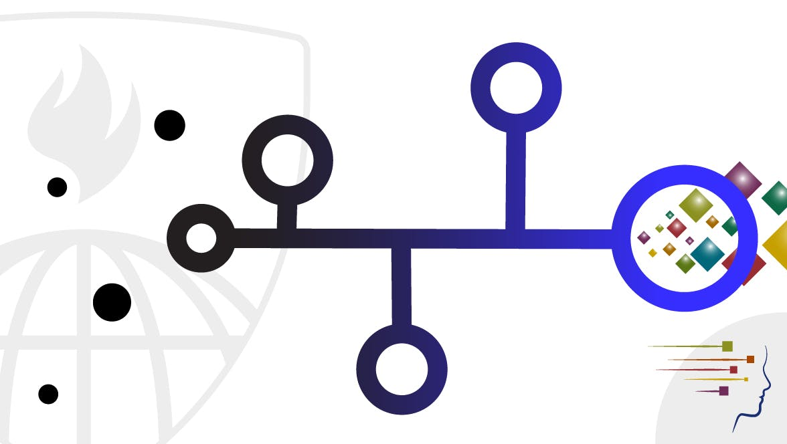

# Getting and Cleaning the Data

[Course Link](https://www.coursera.org/learn/data-cleaning?specialization=jhu-data-science)

Before you can work with data you have to get some. This course will cover the basic ways that data can be obtained.
The course will cover obtaining data from the web, from APIs, from databases and from colleagues in various formats.
It will also cover the basics of data cleaning and how to make data “tidy”. Tidy data dramatically speed downstream data analysis tasks.
The course will also cover the components of a complete data set including raw data, processing instructions, codebooks, and processed data. 
The course will cover the basics needed for collecting, cleaning, and sharing data.

## SKILLS YOU WILL GAIN
1. Data Manipulation
2. Regular Expression (REGEX)
3. R Programming
4. Data Cleansing

## Peer-graded Assignment: Getting and Cleaning Data Course Project
>The purpose of this project is to demonstrate your ability to collect, work with, and clean a data set.

**Getting and Cleaning Data Course Project** : 
>The purpose of this project is to demonstrate your ability to collect, work with, and clean a data set.
 The goal is to prepare tidy data that can be used for later analysis. You will be graded by your peers on a 
series of yes/no questions related to the project. You will be required to submit:
 1) a tidy data set as described below
 2) a link to a Github repository with your script for performing the analysis
3) a code book that describes the variables, the data, and any transformations or work that you performed to clean up the data called CodeBook.md.
You should also include a README.md in the repo with your scripts. This repo explains how all of the scripts work and how they are connected.

One of the most exciting areas in all of data science right now is wearable computing.
Companies like Fitbit, Nike, and Jawbone Up are racing to develop the most advanced algorithms to attract new users. 
The data linked to from the course website represent data collected from the accelerometers from the Samsung Galaxy S smartphone.
 A full description is available at the [site](http://archive.ics.uci.edu/ml/datasets/Human+Activity+Recognition+Using+Smartphones) where the data was obtained.

[Here are the data for the project](https://d396qusza40orc.cloudfront.net/getdata%2Fprojectfiles%2FUCI%20HAR%20Dataset.zip)

>You should create one R script called run_analysis.R that does the following.
1. Merges the training and the test sets to create one data set.
2. Extracts only the measurements on the mean and standard deviation for each measurement.
3. Uses descriptive activity names to name the activities in the data set
4. Appropriately labels the data set with descriptive variable names.
5. From the data set in step 4, creates a second, independent tidy data set with the average of each variable for each activity and each subject.

Submission :
[The Tidy Data Set](https://s3.amazonaws.com/coursera-uploads/peer-review/da3f6bb8e97eff81b5becade10aa1008/secTidySet.txt)

[Repo Containing the code to run the analysis](https://github.com/athos2113/Getting_and_Cleanning_Data).

