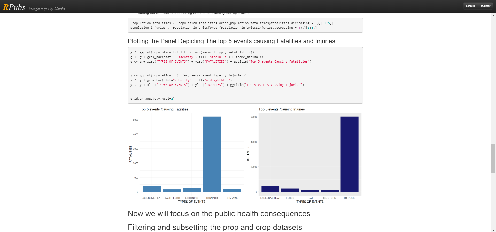

# Reproducible Research

[Course Link](https://www.coursera.org/learn/reproducible-research)

This course focuses on the concepts and tools behind reporting modern data analyses in a reproducible manner. Reproducible research is the idea that data analyses, and more generally, scientific claims, are published with their data and software code so that others may verify the findings and build upon them.  The need for reproducibility is increasing dramatically as data analyses become more complex, involving larger datasets and more sophisticated computations. Reproducibility allows for people to focus on the actual content of a data analysis, rather than on superficial details reported in a written summary. In addition, reproducibility makes an analysis more useful to others because the data and code that actually conducted the analysis are available. This course will focus on literate statistical analysis tools which allow one to publish data analyses in a single document that allows others to easily execute the same analysis to obtain the same results

**SKILLS YOU WILL GAIN** :
1. Knitr
2. Data Analysis
3. R Programming
4. Markup Language

## Peer-graded Assignment: Course Project 1
It is now possible to collect a large amount of data about personal
movement using activity monitoring devices such as a
[Fitbit](http://www.fitbit.com), [Nike
Fuelband](http://www.nike.com/us/en_us/c/nikeplus-fuelband), or
[Jawbone Up](https://jawbone.com/up). These type of devices are part of
the "quantified self" movement -- a group of enthusiasts who take
measurements about themselves regularly to improve their health, to
find patterns in their behavior, or because they are tech geeks. But
these data remain under-utilized both because the raw data are hard to
obtain and there is a lack of statistical methods and software for
processing and interpreting the data.

This assignment makes use of data from a personal activity monitoring
device. This device collects data at 5 minute intervals through out the
day. The data consists of two months of data from an anonymous
individual collected during the months of October and November, 2012
and include the number of steps taken in 5 minute intervals each day.

Data

:
The data for this assignment can be downloaded from the course web
site:

1. Dataset: [Activity monitoring data](https://d396qusza40orc.cloudfront.net/repdata%2Fdata%2Factivity.zip) [52K]

The variables included in this dataset are:

 
1. **steps**: Number of steps taking in a 5-minute interval (missing
 values are coded as `NA`)

2. **date**: The date on which the measurement was taken in YYYY-MM-DD
 format

. 
3. **interval**: Identifier for the 5-minute interval in which
 measurement was taken.

The dataset is stored in a comma-separated-value (CSV) file and there
are a total of 17,568 observations in this 
dataset.

**Assignment**:
This assignment will be described in multiple parts. You will need to
write a report that answers the questions detailed below. Ultimately,
you will need to complete the entire assignment in a **single R
markdown** document that can be processed by **knitr** and be
transformed into an HTML file.

Throughout your report make sure you always include the code that you
used to generate the output you present. When writing code chunks in
the R markdown document, always use `echo = TRUE` so that someone else
will be able to read the code. **This assignment will be evaluated via
peer assessment so it is essential that your peer evaluators be able
to review the code for your analysis**.

For the plotting aspects of this assignment, feel free to use any
plotting system in R (i.e., base, lattice, ggplot2)

Fork/clone the [GitHub repository created for this
assignment](http://github.com/rdpeng/RepData_PeerAssessment1). You
will submit this assignment by pushing your completed files into your
forked repository on GitHub. The assignment submission will consist of
the URL to your GitHub repository and the SHA-1 commit ID for your
repository state.

NOTE: The GitHub repository also contains the dataset for the
assignment so you do not have to download the data separately.

[Link to Assignment Repo](https://github.com/athos2113/RepData_PeerAssessment1).

## Peer-graded Assignment: Course Project 2
**Introduction**:
Storms and other severe weather events can cause both public health and economic problems for communities and municipalities. Many severe events can result in fatalities, injuries, and property damage, and preventing such outcomes to the extent possible is a key concern.

This project involves exploring the U.S. National Oceanic and Atmospheric Administration's (NOAA) storm database. This database tracks characteristics of major storms and weather events in the United States, including when and where they occur, as well as estimates of any fatalities, injuries, and property damage.

###  RPubs that points to your full report for this assignment.

[Link to Rpubs](https://rpubs.com/athos2113/368870)