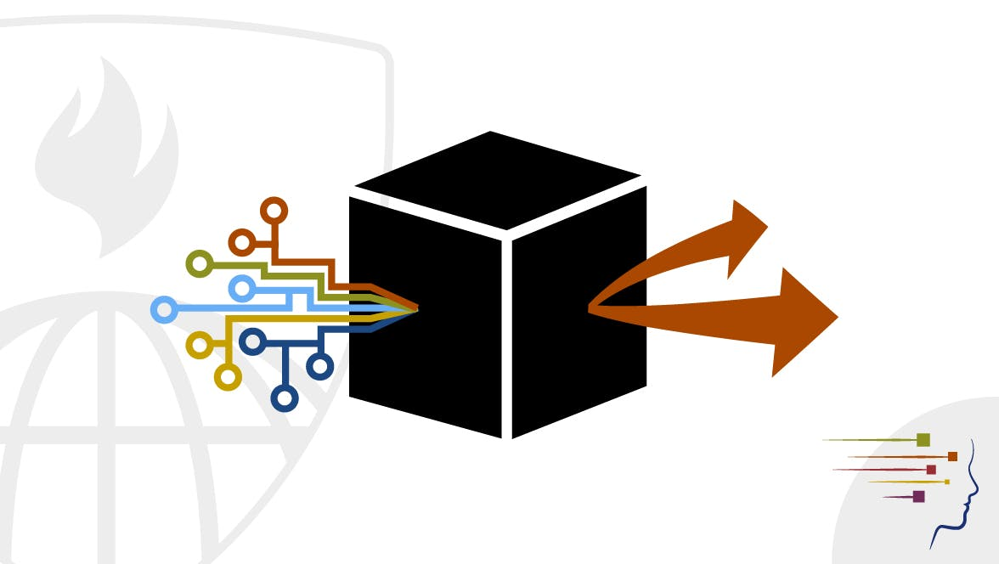

# Practical Machine Learning

[Course Link](https://www.coursera.org/learn/practical-machine-learning)

>One of the most common tasks performed by data scientists and data analysts are prediction and machine learning. This course will cover the basic components of building and applying prediction functions with an emphasis on practical applications. The course will provide basic grounding in concepts such as training and tests sets, overfitting, and error rates. The course will also introduce a range of model based and algorithmic machine learning methods including regression, classification trees, Naive Bayes, and random forests. The course will cover the complete process of building prediction functions including data collection, feature creation, algorithms, and evaluation.

**SKILLS YOU WILL GAIN** :

1. Random Forest
2. Machine Learning (ML) Algorithms
3. Machine Learning
4. R Programming

>One thing that people regularly do is quantify how much of a particular activity they do, but they rarely quantify how well they do it. In this project, your goal will be to use data from accelerometers on the belt, forearm, arm, and dumbell of 6 participants.

**Submission** :
The goal of your project is to predict the manner in which they did the exercise. This is the "classe" variable in the training set. You may use any of the other variables to predict with. You should create a report describing how you built your model, how you used cross validation, what you think the expected out of sample error is, and why you made the choices you did. You will also use your prediction model to predict 20 different test cases.

**Prediction Assignment Writeup** :
Using devices such as Jawbone Up, Nike FuelBand, and Fitbit it is now possible to collect a large amount of data about personal activity relatively inexpensively. These type of devices are part of the quantified self movement – a group of enthusiasts who take measurements about themselves regularly to improve their health, to find patterns in their behavior, or because they are tech geeks. One thing that people regularly do is quantify how much of a particular activity they do, but they rarely quantify how well they do it. In this project, your goal will be to use data from accelerometers on the belt, forearm, arm, and dumbell of 6 participants. They were asked to perform barbell lifts correctly and incorrectly in 5 different ways. More information is available from the website [here](http://web.archive.org/web/20161224072740/http:/groupware.les.inf.puc-rio.br/har)

**Data** :

The training data for this project are available [here](https://d396qusza40orc.cloudfront.net/predmachlearn/pml-training.csv) 
The test data are available [here](https://d396qusza40orc.cloudfront.net/predmachlearn/pml-testing.csv)

[Github Repo Link Containing the .Rmd file and HTML file](https://github.com/athos2113/Practical_Machine_Learning_Coursera)
