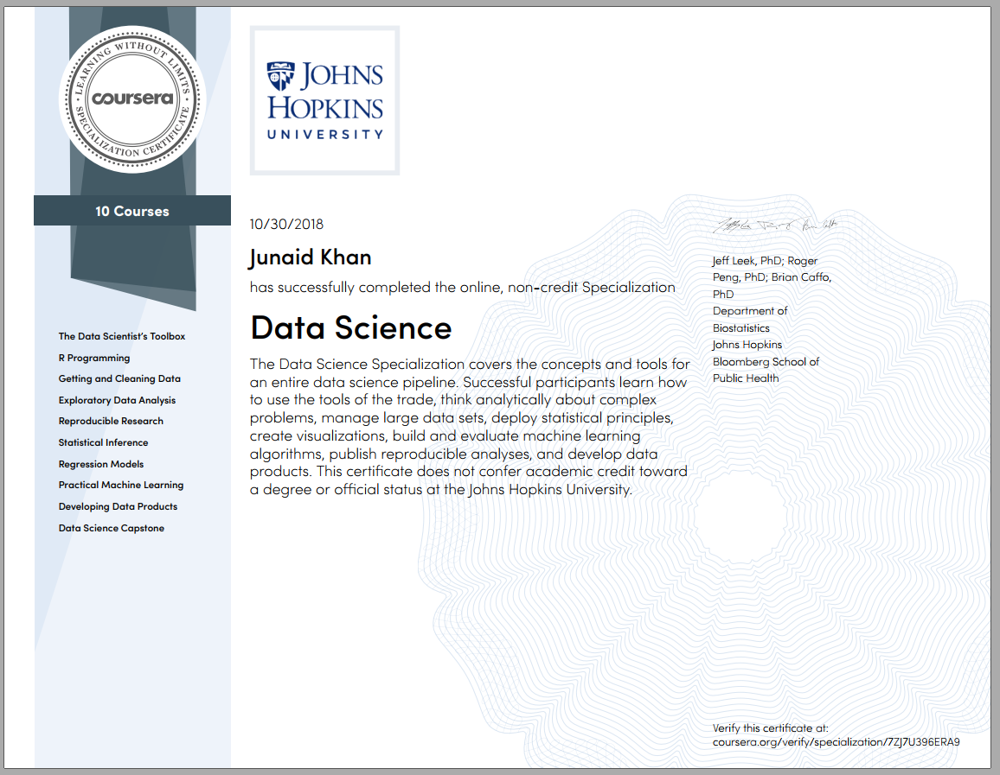

# Data Science Specialization

[Specialization Link](https://www.coursera.org/specializations/jhu-data-science)

>About this Specialization : 
Ask the right questions, manipulate data sets, and create visualizations to communicate results.

This Specialization covers the concepts and tools you'll need throughout the entire data science pipeline, from asking the right kinds of questions to making inferences and publishing results. In the final Capstone Project, you’ll apply the skills learned by building a data product using real-world data. At completion, students will have a portfolio demonstrating their mastery of the material.

**SKILLS YOU WILL GAIN** :
1. Github
2. Machine Learning
3. R Programming
4.Regression Analysis

## There are 10 Courses in this Specialization:

1. The Data Scientist’s Toolbox
2. R Programming
3. Getting and Cleaning Data
4. Getting and Cleaning Data
5. Reproducible Research
6. Statistical Inference
7. Regression Models
8. Practical Machine Learning
9. Developing Data Products
10.Data Science Capstone

I Finished the specialization in 5 months.

